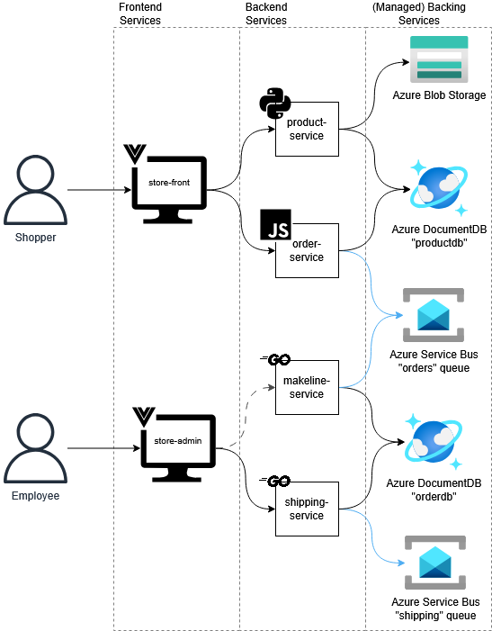

# Best Buy Demo - Microservices Web App Deployed on AKS

## Architecture Diagram



## Application Overview

This project is a AKS-orchestrated, containerized microservices-based e-commerce application simulating a Best Buy storefront and admin operations.

The application is built using a polyglot microservices architecture designed for cloud-native deployment. The entire system is containerized using Docker, with images hosted on Docker Hub, and orchestrated in production using Azure Kubernetes Service (AKS).

The system is divided into two interactive areas: customer-facing storefront and the employee administrative portal. The architecture also prioritizes event-driven design for order fulfillment. Instead of tightly coupling the ordering process, services communicate asynchronously via Azure Service Bus queues to ensure scalability and resilience for future development.

### Component Breakdown

#### Frontend Services

These single-page applications (built on Vue.js) serve as the entry points for different user types.

- **store-front:** The customer-facing e-commerce website. It allows shoppers to browse the product catalog (via the `product-service`) and place orders (via the `order-service`).
- **store-admin:** The internal employee portal. It provides views into the state of orders, shipments, and products by communicating primarily with the `shipping-service` and the `makeline-service`.

#### Backend Services

These containerized services handle specific business domains, written in different languages best suited for their tasks and compatible with my own language skills.

- **product-service (Python):** This service manages the tech product catalog. It retrieves product data from Azure DocumentDB (`productdb`) and serves associated product imagery stored in Azure Blob Storage based on the product id. It also handles the backend for admin product activities like editing, deleting, or adding a new product.
- **order-service (Node.js):** Handles recommendations based on prior orders & successful order handling. When a shopper places an order, this service creates the order object, sets the initial status, and immediately publishes the order as a message to the Azure Service Bus `orders` queue to trigger downstream processing asynchronously.
- **makeline-service (Go):** This service acts as the fulfillment processor. It listens to the `orders` queue. When it receives a new order message, it automatically processes the order creation, updates the status in the `orderdb`, stores it in Azure DocumentDB `orderdb'`. It also handles the backend for admin post-processing order activities like deleting an item (such as an extra Nintendo Switch), shipping, or cancelling an order pre-shipment.
- **shipping-service (Go):** Manages the final stage of the order lifecycle at this stage in the project. It consumes messages from the `shipping` queue to finalize delivery details and updates the `orderdb` with tracking and completion status. In the future, additional services that handle the logistics process could subscribe to the shipping queue.

#### Managed Backing Services (Azure)

I leverage managed Azure PaaS offerings to handle data storage and messaging infrastructure, reducing the operational overhead compared to owned backing services like RabbitMQ and MongoDB.

- **Azure Blob Storage:** Used as an object store for unstructured data, specifically holding high-resolution product images served by the product-service.
- **Azure DocumentDB (Cosmos DB):** A vCore-based Azure Cosmos DB for MongoDB.
    - **`productdb`:** Stores static catalog information (names, descriptions, prices, brand, etc).
    - **`orderdb`:** Stores order data, encompassing transactional info and status history of customer orders from placement to delivery.
- **Azure Service Bus:** Provides reliable, asynchronous enterprise messaging to decouple microservices communications.
    - **`orders` queue:** Buffers incoming customer orders from the web front-end before processing.
    - **`shipping` queue:** Buffers processed orders ready for logistics and delivery.

## Setup (Docker-Compose)

### Prerequisites

1. Linux: Install Docker
2. Windows: Install WSL & download Docker Desktop

### Configure

1. Deploy a cost-effective instance of:
   1. Azure Service Bus
   2. Azure Storage Account
   3. Azure DocumentDB (MongoDB compatible)
2. In Service Bus Namespace, create two queues:
   1. **orders**
   2. **shipping**
3. Find the connection strings/URIs for each of the services:
   1. Azure Service Bus: **Settings -> Shared access policies -> RootManageSharedAccessKey -> Primary connection string**
   2. Azure Storage Account: **Security + networking -> Access keys -> Connection string (for any key)**
   3. Azure DocumentDB: **Settings -> Connection strings -> Global read-write connection string**
4. Configure the `docker-compose.yml` under `/deployment_files` with those connection strings:
   1. Azure Service Bus: `ASB_CONNECTION_STRING`
   2. Azure Storage Account: `BLOB_CONNECTION_STRING`
   3. Azure DocumentDB: `MONGO_URI`

### Run

1. Run the following:
    ```bash
    cd deployment_files
    docker-compose pull && docker-compose up -d
    ```

2. Navigate to the frontends:
    ```bash
    // store-front
    http://localhost:8080/
    // store-admin
    http://localhost:8081/
    ```

## Setup (AKS)

### Configure

1. Deploy a cost-effective instance of:
   1. Azure Service Bus
   2. Azure Storage Account
   3. Azure DocumentDB (MongoDB compatible)
2. Deploy AKS with the provided templates in `/deployment_files/aks_templates`
   1. You may have to adjust the regions depending on your restrictions
   2. **Overview -> Connect -> Run** the two provided command line scripts to set the cluster namespace for kubectl
3. In Service Bus Namespace, create two queues:
   1. **orders**
   2. **shipping**
4. In Storage Account, do the following:
   1. Create a container `product-images`
   2. Upload the images in `/deployment_files/images` there
5. Find the connection strings/URIs for each of the services:
   1. Azure Service Bus: **Settings -> Shared access policies -> RootManageSharedAccessKey -> Primary connection string**
   2. Azure Storage Account: **Security + networking -> Access keys -> Connection string (for any key)**
   3. Azure DocumentDB: **Settings -> Connection strings -> Global read-write connection string**
6. Configure the `secrets.yaml` under `/deployment_files` with those connection strings:
   1. Azure Service Bus: `ASB_CONNECTION_STRING`
   2. Azure Storage Account: `BLOB_CONNECTION_STRING`
   3. Azure DocumentDB: `MONGO_URI`

### Run

1. Run the following:
    ```bash
    cd deployment_files
    kubectl apply -f secrets.yaml
    kubectl apply -f best-buy.yaml
    ```
2. Wait for the pods to spin up; check:
    ```bash
    kubectl get pods
    ```
3. Navigate to the frontends through the AKS portal: **Kubernetes resources -> Services & Ingresses -> External IPs** OR:
    ```bash
    kubectl get services
    ```

## Links

### Repository links

| Service          | Link                                               |
| ---------------- | -------------------------------------------------- |
| store-front      | https://github.com/AliceYangAC/store-front-bb      |
| store-admin      | https://github.com/AliceYangAC/store-admin-bb      |
| product-service  | https://github.com/AliceYangAC/product-service-bb  |
| order-service    | https://github.com/AliceYangAC/order-service-bb    |
| makeline-service | https://github.com/AliceYangAC/makeline-service-bb |
| shipping-service | https://github.com/AliceYangAC/shipping-service-bb |

### Docker Hub links

| Service          | Link                                                                          |
| ---------------- | ----------------------------------------------------------------------------- |
| store-front      | https://hub.docker.com/repository/docker/aliceyangac/store-front/general      |
| store-admin      | https://hub.docker.com/repository/docker/aliceyangac/store-admin/general      |
| product-service  | https://hub.docker.com/repository/docker/aliceyangac/product-service/general  |
| order-service    | https://hub.docker.com/repository/docker/aliceyangac/order-service/general    |
| makeline-service | https://hub.docker.com/repository/docker/aliceyangac/makeline-service/general |
| shipping-service | https://hub.docker.com/repository/docker/aliceyangac/shipping-service/general |

## Video Demo

Youtube link: https://youtu.be/fzveFWe2mbE
